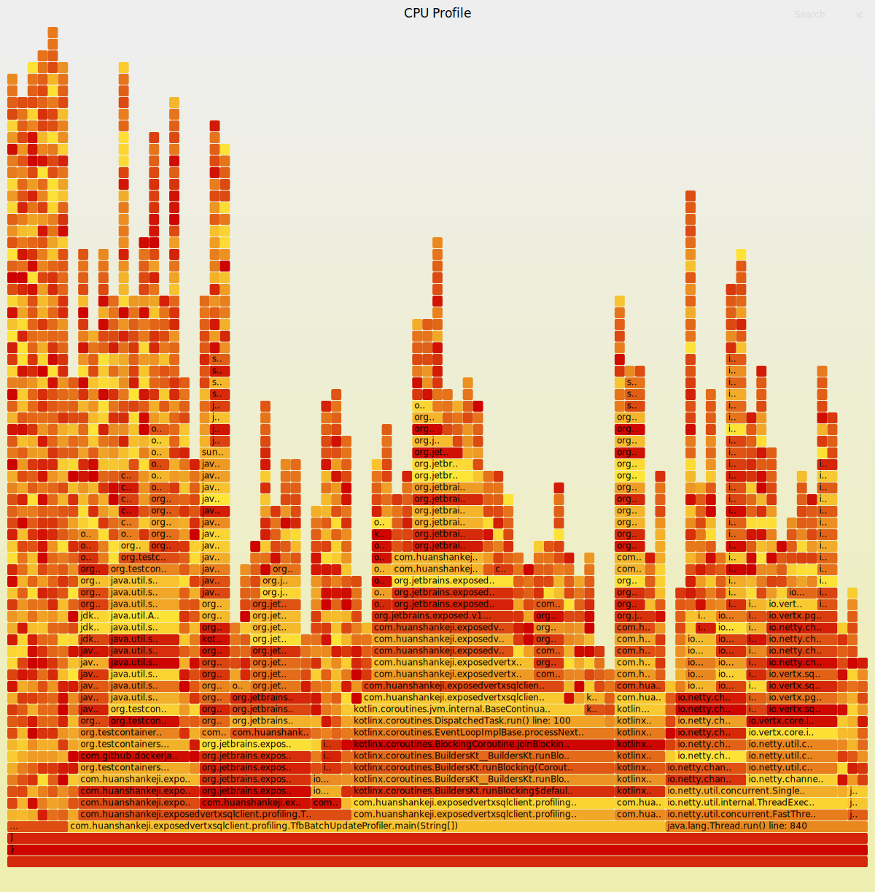
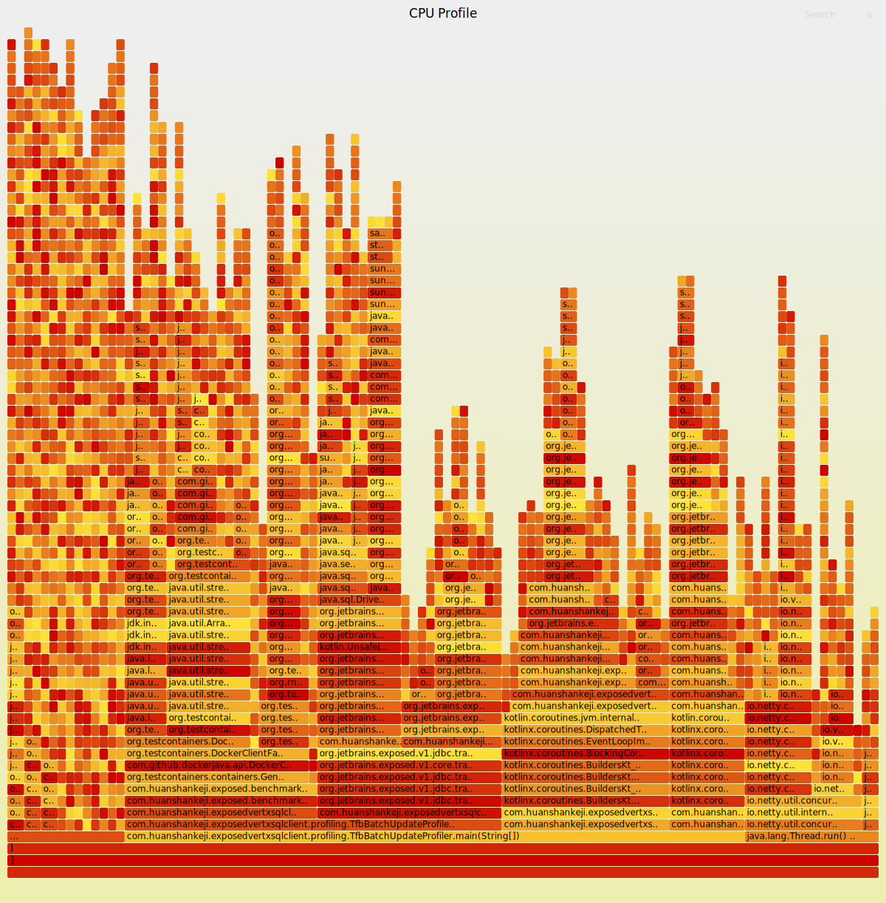

# Flame Graph Comparison - Visual Summary

## Side-by-Side Comparison

### DatabaseExposedTransactionProvider


**Stats:**
- Average iteration time: **13,551 ms**
- Unique stack traces: **85**
- Flame graph size: 444 KB

---

### JdbcTransactionExposedTransactionProvider  


**Stats:**
- Average iteration time: **13,643 ms** (+0.68%)
- Unique stack traces: **104** (+22%)
- Flame graph size: 586 KB

---

## Key Observations

### Width Comparison (Time Spent)

The flame graphs show that **both configurations spend similar time in the same operations**:

1. **Database Operations** (widest sections):
   - PostgreSQL query execution
   - Network I/O with the database
   - Result set processing

2. **Statement Preparation** (medium-width sections):
   - Exposed DSL statement building
   - SQL generation
   - Parameter binding

3. **Transaction Management** (thin sections):
   - Very minimal width in both graphs
   - Shows that transaction overhead is negligible
   - Explains why the two approaches have similar performance

### Height Comparison (Call Stack Depth)

- Both show similar maximum stack depths (~10-15 frames)
- JdbcTransactionExposedTransactionProvider has more varied paths (more unique stacks)
- DatabaseExposedTransactionProvider has simpler, more uniform execution

### Visual Patterns

**DatabaseExposedTransactionProvider (Left)**:
- More uniform "blocks" of similar operations
- Cleaner, more repetitive patterns
- Fewer branches in the call graph

**JdbcTransactionExposedTransactionProvider (Right)**:
- More varied execution patterns
- Additional connection management visible
- More complex but still dominated by database I/O

## The Verdict

The flame graphs visually confirm what the numbers show: **the choice of transaction provider has minimal impact on performance** because:

1. **Database I/O is the bottleneck** (widest sections in both graphs)
2. **Transaction overhead is minimal** (very thin sections, barely visible)
3. **Both spend time in the same operations** (similar overall shape)

The 0.68% difference is likely just noise in the measurements, as evidenced by the nearly identical flame graph structures.

## Interactive Features

Remember, these SVG flame graphs are **interactive**:

1. **Click** any rectangle to zoom in and focus on that subtree
2. **Hover** over any rectangle to see:
   - Full function name
   - Exact time percentage
   - Sample count
3. **Search** for specific functions using the search box
4. **Reset** zoom to return to the full view

## Technical Details

- **Profiler**: Java Flight Recorder (JFR)
- **Sampling Interval**: 1ms (default 'profile' settings)
- **Event Type**: `jdk.ExecutionSample` (CPU sampling)
- **Flame Graph Tool**: FlameGraph by Brendan Gregg

## How to Generate These

```bash
# 1. Run profiling
./profile-benchmark-jfr.sh

# 2. Convert to flame graphs
python3 jfr-to-flamegraph.py

# 3. Open in browser
open profiling-results/tfb-batch-update-*_flamegraph.svg
```

---

For detailed analysis, see [PROFILING_ANALYSIS.md](./PROFILING_ANALYSIS.md)
